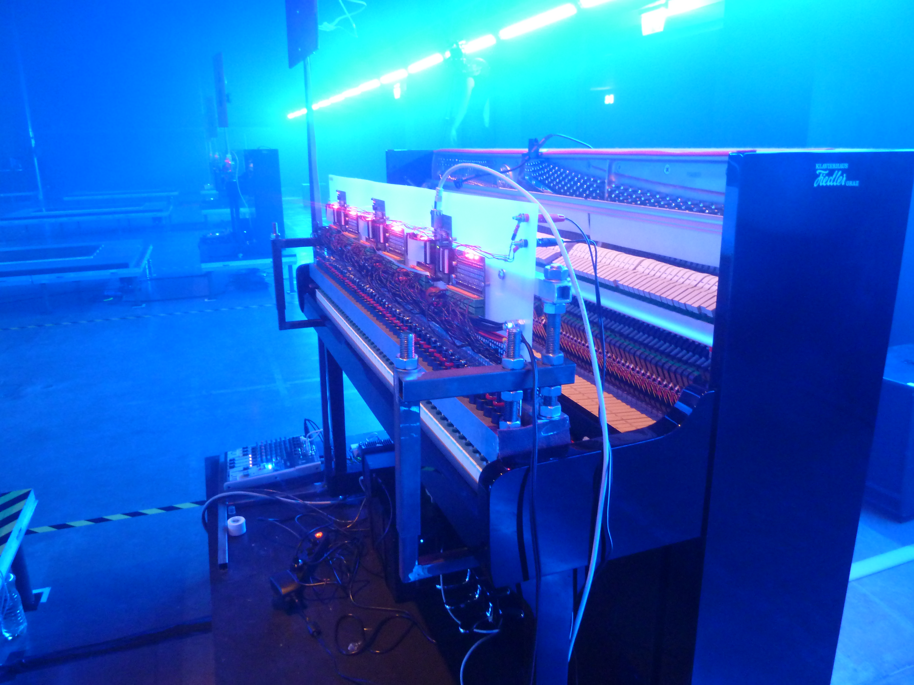

===========
PIANOPLAYER
===========
Automatic Piano Player robot development
----------------------------------------

:Author: Winfried Ritsch
:Contact: ritsch _at_ algo.mur.at, ritsch _at_ iem.at
:Copyright: winfried ritsch -  algorythmics 2004+
:Master: https://github.com/algorythmics/pianoplayer

    Rhea first performance in Maschinenhalle 2010

aka "autoklavierspieler" is a robotic piano player, also called "Vorsetzer", which is designed to play any popular (large) piano with individual dynamics of each note as quickly as possible - making up a player-piano.

Structure
---------

doku
 some history and facts on the different generations of the robotic piano player
 
firmware
 firmware for the microcontrollers in the different generations
 
hardware
 a collection for showing the hardware
 
(c) GPLV3, winfried ritsch 2003+
